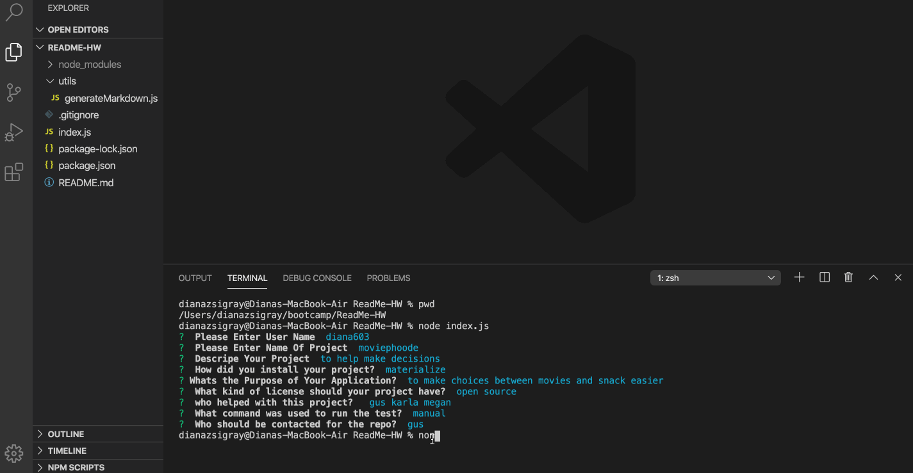

 
# README Generator 

This is a Node application that prompts the user a series of questions which than takes their response and generates a new markdown file.

# Installation

- Clone this repo down by running `git clone` in your terminal and pasting in the SSH/HTTP link
- After opening the project, run `npm i` or `npm install`

# Contact
https://github.com/diana603